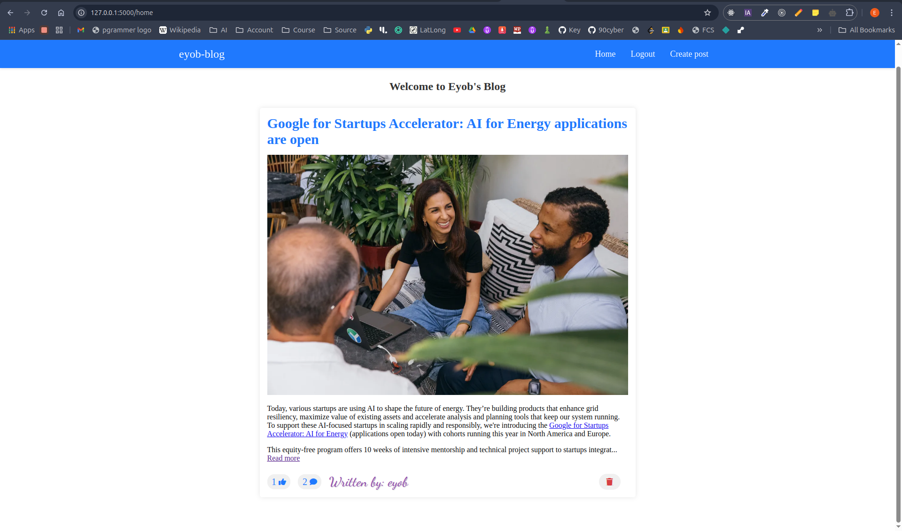
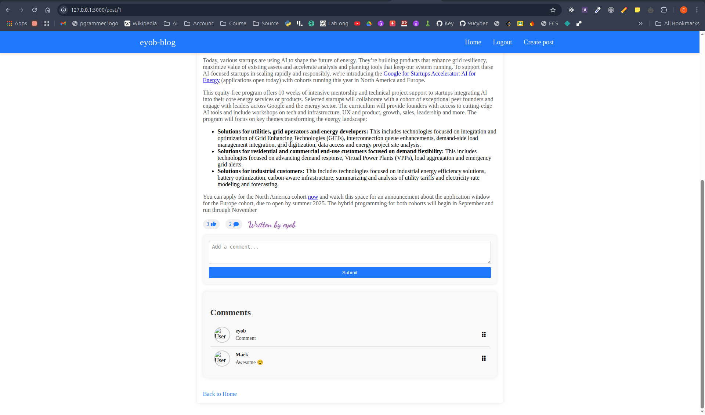

# Blog App
#### Welcome to this blog app, a simple yet powerful application built with Flask. This project lets users create posts, like and unlike them with a gray-to-blue toggle, add comments, and manage content with admin privileges—all with a clean, server-side rendered interface.

---

## Features
- User Authentication: Secure registration, login, and logout with Flask-Login.
- Post Management: View posts on the home page and full details on individual pages.
- Likes: Toggle likes with a color change from gray to blue.
- Comments: Add, edit, or delete comments, restricted to owners or admins.
- Admin Privileges: Delete posts and manage comments.
- Responsive UI: Styled with CSS and Font Awesome icons.
- Server-Side Rendering: No heavy JavaScript, all Flask-powered.

---

## Tech Stack
- Backend: Flask (Python), SQLAlchemy (ORM)
- Frontend: Jinja2 templates, HTML, CSS, minimal JavaScript
- Database: SQLite (default; can use PostgreSQL, etc.)
- Authentication: Flask-Login
- Migrations: Flask-Migrate
- Environment: python-dotenv
- Styling: Custom CSS with Font Awesome
---
## How to Use It
Here’s how to run this blog app:
1. Clone the repository:
   ```bash
   git clone https://github.com/Eyob-Dev/blog-byFlask
   cd blog-app
2. Set up a virtual environment:
   ```bash
   python -m venv .venv
   source .venv/bin/activate  # On Windows: .venv\Scripts\activate
3. Install dependencies:
   Create a requirements.txt with:
   ```text
   Flask==2.3.2
   Flask-SQLAlchemy==3.0.3
   Flask-Login==0.6.2
   Flask-Migrate==4.0.4
   python-dotenv==1.0.0
   ```
   * Then run:
   ```bash
   pip install -r requirements.txt
4. Configure environment variables:
   * Create a .env file in the root:
   ```text
   SECRET_KEY=your-secret-key-here
   SQLALCHEMY_DATABASE_URI=sqlite:///blog.db
   ```
   * Make a key:
   ```bash
   python -c "import os; print(os.urandom(24).hex())"
5. Initialize the database:
   ```bash
   flask db init
   flask db migrate
   flask db upgrade
6. Run the app:
   ```bash
   flask run
   Go to http://127.0.0.1:5000/home in your browser.
---
## Screenshot

*Caption: The home page with posts and likes.*

*Caption: The post-detail page with posts and likes.*

---
## Quick Tips
- Check /home for all posts.
- Click a post title to like or comment.
- Set yourself as admin to delete stuff!

Enjoy this Flask blog project!